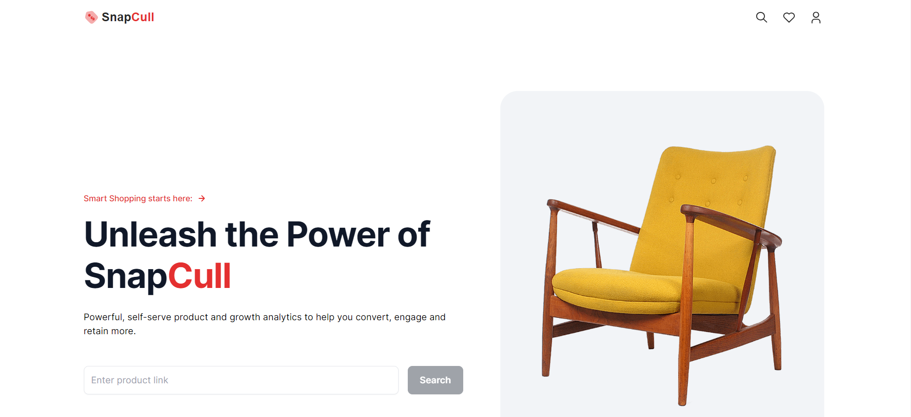
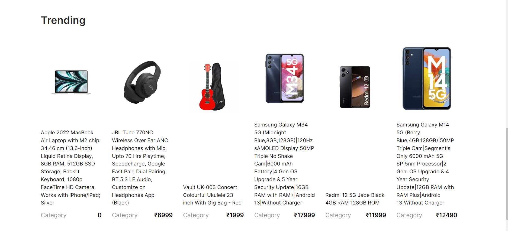
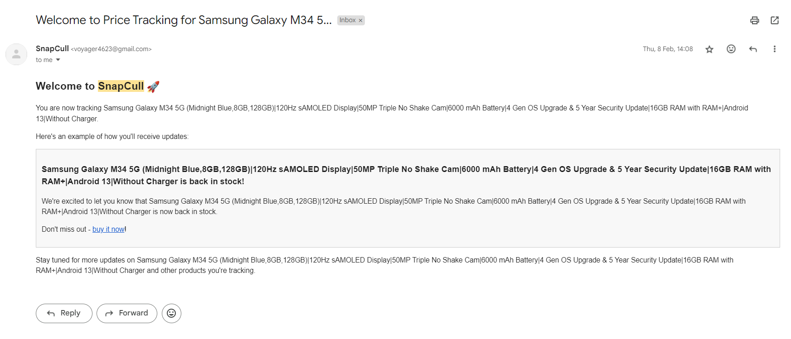

An automated web scraping tool with Brightdata which extracts product details and price history from ecommerce sites.
Notification system via cron jobs, alerting users of price drops and stock updates for trending products.
Managed product data in MongoDB.

Tech Stack used:
->  Next.js
->  MongoDb
->  Tailwind CSS
->  BrightData API
->  Cron functionality
->  nodemailer

